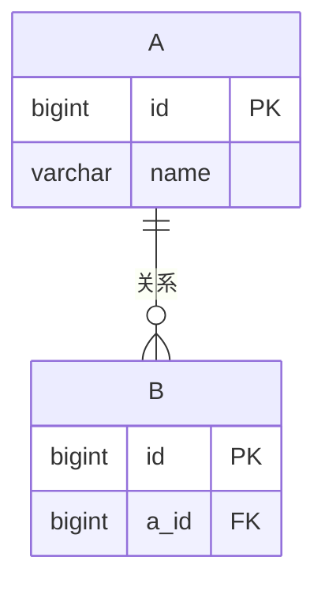
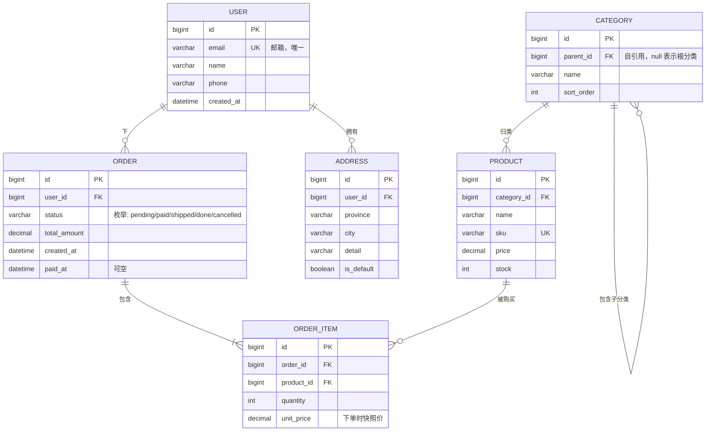
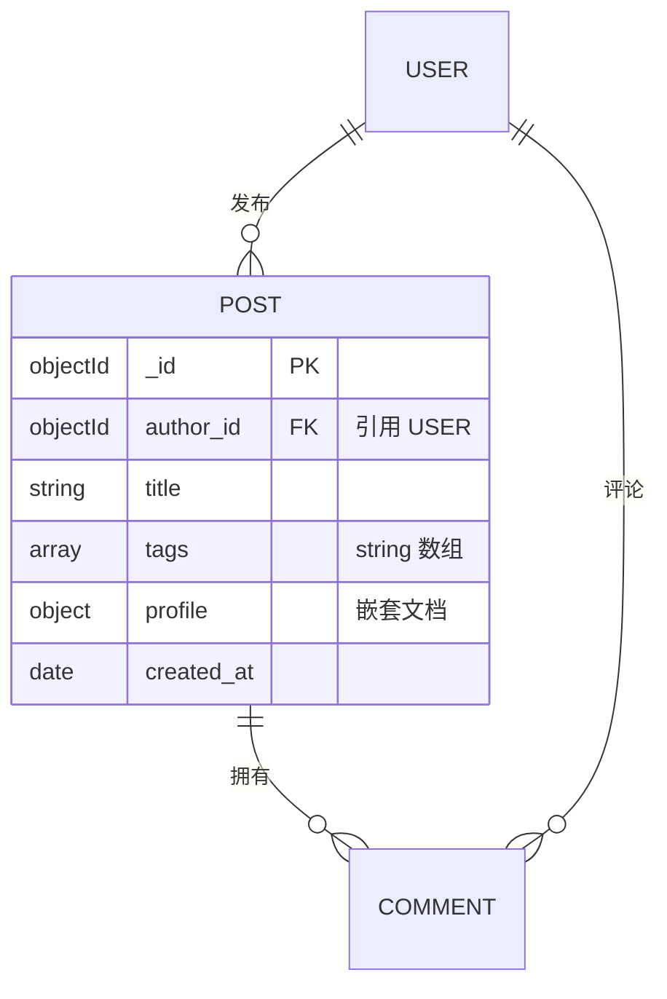

# Mermaid ER 图语法速查

## 最小可用模板



## 基数（cardinality）

| 符号 | 含义 | 中文 |
|---|---|---|
| `\|\|` | exactly one | 一 |
| `o\|` | zero or one | 零或一 |
| `}o` | zero or many | 零或多 |
| `}\|` | one or many | 一或多 |

## 常用组合

- `A ||--|| B` — 一对一
- `A ||--o{ B` — 一对多（A 是"一"方）
- `A }o--o{ B` — 多对多（必须有中间表）
- `A ||--|| B : "等价于"` — 自引用（同一表内）
- `A }o--o{ A` — 自引用多对多（如关注关系）

## 字段类型（type 区）

Mermaid 不强制类型，用项目实际类型标注。建议统一用 MySQL/PostgreSQL 通用类型：

```
bigint, int, smallint, tinyint
varchar(N), text, char(N)
datetime, timestamp, date, time
decimal(M,D), float, double
boolean / bool
json, jsonb
enum('a','b','c')
```

MongoDB 类型标注：

```
objectId, string, int, long, double, bool
date, timestamp
object, array<T>, array
```

## 字段标记

- `PK` — 主键
- `FK` — 外键
- `UK` — 唯一键

可以同时标：`bigint id PK "主键"`，引号里加注释。

## 完整示例：电商订单系统



## MongoDB 集合关系图

MongoDB 没有外键约束，关系靠应用层维护。Mermaid 标注方式：



注意：
- `array<T>` 表示数组字段
- `object` 表示嵌套文档
- 引用字段仍标 `FK`（语义上）

## 渲染说明

- GitHub / GitLab / VSCode 预览均原生支持 `erDiagram`
- 在线预览：https://mermaid.live/
- 如果字段太多图拥挤，可以拆成多个 ER 图（按模块）
- 中文字段名在 Mermaid 里可能显示问题，**字段名用英文/拼音，注释用中文**

## 常见错误

- ❌ `A ||--o| B`（写反了，应该是 `o{`）
- ❌ 字段列表没写 `erDiagram` 块（必须包含在块内）
- ❌ 在字段类型里加引号 `varchar(255)` 中间没有空格（用 `varchar` 不用写长度，或者写 `varchar_255`）
- ❌ 中文实体名（用英文 `USER` 而不是 `用户`）
